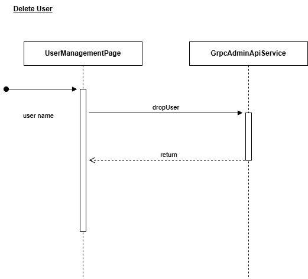
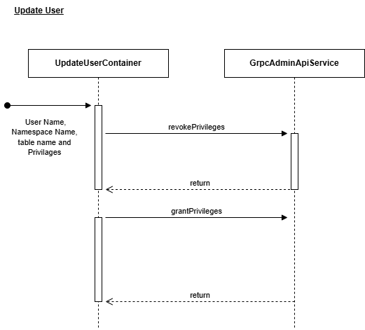
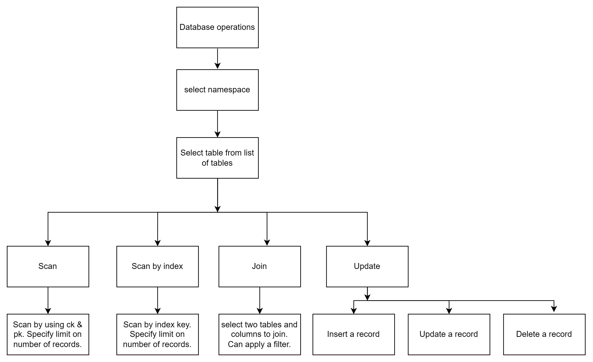
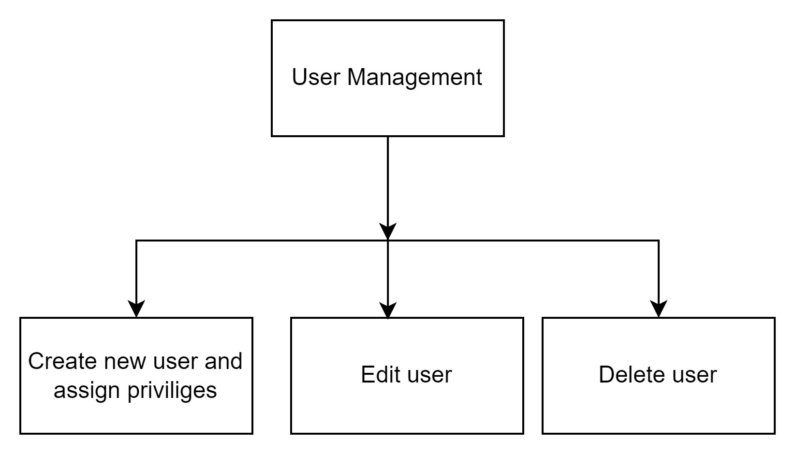

# Functionality Flow Diagrams

| Component                     | Description                                                                                                                                                                                                                      |
|-------------------------------|----------------------------------------------------------------------------------------------------------------------------------------------------------------------------------------------------------------------------------|
| Login Page                    | The LoginPage component provides a simple form to enter a username and password, with error handling for incorrect or missing inputs and "Remember Me" features.                                                                |
| Database Operation Page       | The Database Operation Page allows users to select a database and load its tables directly into the sheet.                                                                                                                   |
| ScanContainer                 | The Scan Operation allows users to input partition key (pt) and clustering key (ck) values either manually or directly from the sheet, then refresh the query to perform the scan.                                           |
| ScanByIndexContainer          | The Scan By Index Operation lets users select an index from the dropdown, enter the index key value or directly from the sheet, and then refresh the query to perform the operation.                                           |
| JoinsContainer                | In the Joins operation, users select table1 and table2 from dropdowns, then choose a column from each table for the join. Next, a join type is selected from the list. Optionally, if an idx is available in the join combination, users may apply a filter, though it's not mandatory. Finally, submit to execute the join operation, with or without the filter. |
| CurdContainer                 | In the Update Operation, users can select one or multiple records from the table data and specify an operation (insert, update, or delete) using the leftmost column in the sheet. After choosing an operation, clicking "Process" opens a popup displaying the record counts for the selected operation. Users can then review and confirm by clicking "OK" to execute. |
| DatabaseManagementPage        | On the Database Management Page, users can select a namespace to view its tables and perform operations such as creating, editing, and deleting tables.                                                                           |
| CreateTableContainer          | In the Create Table component, users can create a table by entering a table name and adding columns. Once all the necessary information is provided, users can proceed to create the table.                                      |
| EditTableContainer (Alter Table) | In the Alter Table component, users can add new columns to an existing table and remove the idx from it.                                                                                                                     |
| UserManagementPage            | On the User Management Page, users can view existing users, create new users, update user privileges, and delete users as needed.                                                                                              |
| CreateUserContainer           | In the Create User component, admin users can create a new user by entering a username and password, selecting a role, choosing a namespace, and assigning specific privileges associated with that namespace.                     |
| UpdateUserContainer           | In the Update Privileges component, users can view privileges for a specific namespace and for particular tables within that namespace. Users also have the option to update these privileges as needed.                        |
| AppGrpcService/AppGrpcAdminService | The AppGrpcService or AppGrpcAdminService layer is generally responsible for managing gRPC operations, acting as an intermediary between the gRPC client and server to handle request and response handling, error management, and data transformations. |
| AuthSlice                     | The AuthSlice layer is typically part of a Redux-based state management setup and is responsible for managing authentication-related state in an application. This layer often includes actions, reducers, and selectors specifically focused on handling user authentication related state changes. |
| ExcelService                  | The ExcelService layer is a service layer designed to manage interactions with Excel using the Excel JavaScript API. This layer abstracts away the complexities of working directly with the API, providing a structured interface to interact with Excel worksheets, cells, tables, charts, and other elements. |

 ### Authentication Flow

At each layer, the following operations are performed:

1. **LoginPage**: Collects the username and password from the user and calls the `Login` method in `AppGrpcService`.
2. The `Login` method makes a gRPC request to the Scalar cluster and returns a response.
3. If the login is successful, the user is redirected to the application; otherwise, they remain on the LoginPage.

### Database Operations

At each layer, the following operations are performed:

1. **DatabaseOperationPage**: Collects the namespace from the user and calls the `GetAllTables` method in `AppGrpcService`.
2. The `GetAllTables` method makes a gRPC request to the Scalar cluster and returns a response.
3. The `DatabaseOperationPage` forwards the response to `ExcelService` through the `WriteDataToSheet` method.
4. The `WriteDataToSheet` method writes the data to an Excel sheet using the Excel JavaScript API.
5. 

Scan is a sub-functionality of Database Operations, allowing the user to filter data based on the partition-key and clustering-key.  
At each layer, the following operations are performed:

1. **ScanContainer**: Collects partition-key and clustering-key from the user and calls the `scanByPartitionKeyAndClusteringKey` method in `AppGrpcService`.
2. The `scanByPartitionKeyAndClusteringKey` method makes a gRPC request to the Scalar cluster and returns a response.
3. The `ScanContainer` forwards the response to `ExcelService` through the `MapDataToExcel` method.
4. The `MapDataToExcel` method writes the data to an Excel sheet using the Excel JavaScript API.

Scan By Index is a sub-functionality of Database Operations, allowing the user to filter data based on the partition-key and clustering-key.  
At each layer, the following operations are performed:

1. **ScanByIndexContainer**: Collects the secondary index from the user and calls the `scanByIndex` method in `AppGrpcService`.
2. The `scanByIndex` method makes a gRPC request to the Scalar cluster and returns a response.
3. The `ScanByIndexContainer` forwards the response to `ExcelService` through the `MapDataToExcel` method.
4. The `MapDataToExcel` method writes the data to an Excel sheet using the Excel JavaScript API.

Join is a sub-functionality of Database Operations, allowing the user to join two tables and filter with index.  
At each layer, the following operations are performed:

1. **JoinContainer**: Collects the first table name, second table name, first table column name, and second table column name (optional filter with index data) from the user and calls the `executeQuery` method in `AppGrpcService`.
2. The `executeQuery` method makes a gRPC request to the Scalar cluster and returns a response.
3. The `JoinContainer` forwards the response to `ExcelService` through the `WriteJoinsTableDataToSheet` method.
4. The `WriteJoinsTableDataToSheet` method writes the data to an Excel sheet using the Excel JavaScript API.

Insert, Update, and Delete is a sub-functionality of Database Operations, allowing the user to perform these actions in a table.  
At each layer, the following operations are performed:

1. Collects the table data from the Excel sheet and calls the `executeUpdate` and `executeDelete` methods in `AppGrpcService`.
2. The `executeUpdate` and `executeDelete` methods make a gRPC request to the Scalar cluster and return a response.

### Database Management

Get All Tables is a sub-functionality of User Management, allowing the Admin to see the list of tables.  
At each layer, the following operations are performed:

1. **DatabaseManagementPage**: It takes the namespace name and calls the `getAllTables` method in `GrpcAdminApiService`.
2. The `getAllTables` method makes a gRPC request to the Scalar cluster and returns the response.

Create Table is a sub-functionality of Database Management, allowing the Admin to create a table in the database.  
At each layer, the following operations are performed:

1. **CreateTableContainer**: Collects the table name and column details from the user and calls the `createTable` method in `GrpcAdminApiService`.
2. The `createTable` method makes a gRPC request to the Scalar cluster and returns the response.
   

Drop Table is a sub-functionality of Database Management, allowing the Admin to drop a table in the database.  
At each layer, the following operations are performed:

1. **DatabaseManagementPage**: When the user clicks on the delete icon, it takes the table name and database name and calls the `dropTable` method in `GrpcAdminApiService`.
2. The `dropTable` method makes a gRPC request to the Scalar cluster and returns the response.

Alter Table is a sub-functionality of Database Management, allowing the Admin to alter a table in the database.  
At each layer, the following operations are performed:

1. **CreateTableContainer**: Collects the column details, drop index, and create index details from the user and calls the `addNewColumnToTable`, `dropIndex`, and `createIndex` methods in `GrpcAdminApiService`.
2. The `addNewColumnToTable`, `dropIndex`, and `createIndex` methods make a gRPC request to the Scalar cluster and return the response.

### User Management
 

Get All Users is a sub-functionality of User Management, allowing the Admin to see the list of users.  
At each layer, the following operations are performed:

1. **UserManagementPage**: It takes the namespace name and calls the `getAllUsers` method in `GrpcAdminApiService`.
2. The `getAllUsers` method makes a gRPC request to the Scalar cluster and returns the response.

Create User is a sub-functionality of User Management, allowing the Admin to create a user in the database.  
At each layer, the following operations are performed:

1. **CreateUserContainer**: Collects the username, password, namespace name, and privileges from the user (Role Admin) and calls the `createUser` and `grantPrivileges` methods in `GrpcAdminApiService`.
2. The `createUser` and `grantPrivileges` methods make a gRPC request to the Scalar cluster and return the response.

Delete User is a sub-functionality of User Management, allowing the Admin to delete a user.  
At each layer, the following operations are performed:

1. **UserManagementPage**: When the user clicks on the delete icon, it takes the username and calls the `dropUser` method in `GrpcAdminApiService`.
2. The `dropUser` method makes a gRPC request to the Scalar cluster and returns the response.

Update User is a sub-functionality of User Management, allowing the Admin to update a user in the database.  
At each layer, the following operations are performed:

1. **UpdateUserContainer**: Collects the namespace name, table name, and privileges from the user (Role Admin) and calls the `revokePrivileges` and `grantPrivileges` methods in `GrpcAdminApiService`.
2. The `revokePrivileges` and `grantPrivileges` methods make a gRPC request to the Scalar cluster and return the response.

### Flow Diagrams of Important Functionalities

**User Flow**

**Database Operations**
- Admin/Other user

**Database Management**

**User management**

