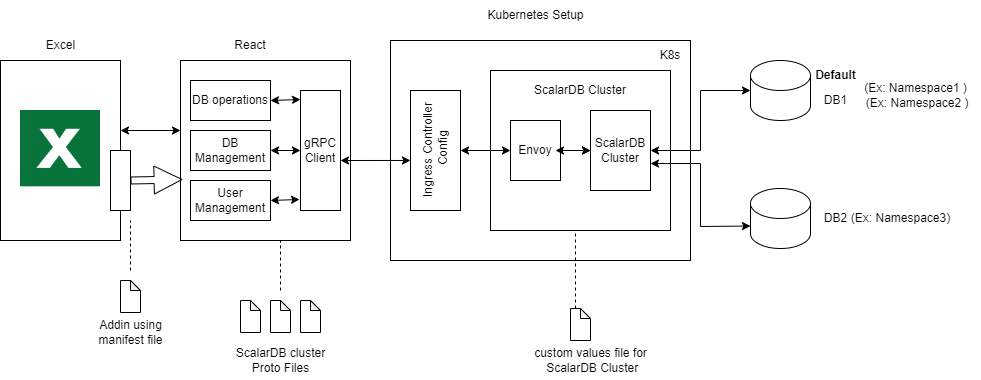

## Application Architecture 

### Objective
The primary objective of this Excel Add-in is to streamline database management for users interacting with underlying ScalarDB, making it more accessible and user-friendly. It aims to eliminate the need for complex database commands or external tools by integrating database operations directly into Excel, allowing users to manage their ScalarDB data in a familiar environment. 

This tool empowers both technical and non-technical users to efficiently perform tasks such as data querying, record management, and administrative operations, all while reducing the potential for errors and increasing productivity.

### System Architecture Diagram



### Key Configuration Files

Key configuration files include:

**Manifest File**
This file is essential for initializing the Excel Add-in. You can upload it to the "My Add-ins" section in Excel to get started.

**Proto Files**
We use three Proto files:
- `scalardb-auth.proto`
- `scalardb-cluster.proto`
- `scalardb-cluster-sql.proto`

These files correspond to ScalarDB Cluster version 3.13.0 and define the communication structure between the client and ScalarDB via gRPC.

**Helm Values File**
The `scalardb-cluster-custom-values.yaml` file is used to deploy the ScalarDB cluster using Helm. It defines the custom configurations required for creating the ScalarDB cluster.


### Interface Description

This application leverages the ScalarDB Cluster gRPC API to perform various database operations. Client stub code was generated in React from Proto files to facilitate interaction with the ScalarDB cluster. The front-end, built using React, ensures seamless integration with the ScalarDB cluster, enabling efficient execution of database operations via the gRPC API.

The application also utilizes Excel APIs to present and manage data within Excel. This involves populating spreadsheets with data, displaying column headers, and offering a user-friendly interface that allows users to interact with the data directly in Excel.

The project is built using React version 18.2.0 and requires the ScalarDB Cluster to be deployed and configured with the appropriate database setup.

### Software and Library Versions

- **Excel Version**: Greater than 2019
- **React Version**: 18.2.0
- **Protocol Buffers**: v27.3
- **ScalarDB Cluster Product Version**: 3.12.2
  
## Application Constraints

- **Scope**: The scope of this design is specifically for the Microsoft Excel desktop application and does not consider Google Worksheets.
  
- **Excel Compatibility**: This Add-in is designed for use with Excel 2019 and later versions.

### External Databases

The system relies on an external database for storing information such as users and other related data (configuration details need to be specified).

In ScalarDB, a namespace called **"scalardb"** is automatically created, along with tables that store tokens, users, and privileges, as part of the ScalarDB authentication process. These are created in the default storage, as defined in the `scalardb-cluster-custom-values.yaml` configuration file.

The system uses an external database for storing users and other related information.

# ScalarDB Cluster Configuration

We need to configure databases in the ScalarDB cluster in the `scalardb-cluster-custom-values.yaml` file.

Ensure that the following properties are added and enabled in the file:

```yaml
Enable ScalarDB Cluster Authentication:
scalar.db.cluster.auth.enabled=true
```
```yaml
For Using ScalarDB Cluster SQL, enable the following:
scalar.db.sql.enabled=true
scalar.db.cross_partition_scan.enabled=true
scalar.db.cross_partition_scan.filtering.enabled=true
```
We need to configure the databases in scalardb-cluster-custom-values.yaml file

For example check this below configuration for multi storage configuration for two mysql services creyed in k8s


```yaml
scalar.db.storage: multi-storage
scalar.db.multi_storage.storages: mysql,mysql1

# MySQL storage configuration
scalar.db.multi_storage.storages.mysql.storage: jdbc
scalar.db.multi_storage.storages.mysql.contact_points: jdbc:mysql://my-release-mysql.default.svc.cluster.local:3306/
scalar.db.multi_storage.storages.mysql.username: root
scalar.db.multi_storage.storages.mysql.password: root

# MySQL1 storage configuration
scalar.db.multi_storage.storages.mysql1.storage: jdbc
scalar.db.multi_storage.storages.mysql1.contact_points=jdbc:mysql://second-release-mysql.default.svc.cluster.local:3306/
scalar.db.multi_storage.storages.mysql1.username=root
scalar.db.multi_storage.storages.mysql1.password=root

# Namespace mapping (format namespace_name:storage_name)
scalar.db.multi_storage.namespace_mapping=coordinator:mysql,scalar_file_management:mysql,scalar_box:mysql1

# Default storage(default _storage will hold all the authentication related details)
scalar.db.multi_storage.default_storage=mysql
```

## Functionalities

**These are functionalities listed below.**

| Functionality                                        | Admin | Normal User | Corresponding gRPC API           |
|-----------------------------------------------------|-------|-------------|-----------------------------------|
| **1. Authentication**                               |       |             |                                   |
| Login                                               | Yes   | Yes         | /login                            |
| Logout                                              | Yes   | Yes         | /logout                           |
| **2. Dashboard**                                    |       |             |                                   |
| Fetch all namespaces within the cluster             | Yes   | Yes         | /getNamespaceNames                |
| Scan records based on a specified partition and clustering key | Yes   | Yes         | /scan                             |
| Fetch table metadata (Partition key, Clustering key, etc.) | Yes   | Yes         | /getTableMetadata                 |
| Scan records based on a specified index (with/without a limit) | Yes   | Yes         | /scan                             |
| Delete record                                       | Yes   | Yes         | /delete                           |
| Insert and update records                            | Yes   | Yes         | /put                              |
| Start, commit, rollback transactions                | Yes   | Yes         | /begin, /commit, /rollback        |
| Join tables (Inner, Left, Right Join)              | Yes   | Yes         | /execute                          |
| **3. Database Management**                           |       |             |                                   |
| Create table                                       | Yes   | No          | /createTable                      |
| Drop table(Delete table)                                        | Yes   | No          | /dropTable                        |
| Add new column to the table                        | Yes   | No          | /addNewColumnToTable              |
| Create index in an existing table                  | Yes   | No          | /createIndex                      |
| Drop index in an existing table                     | Yes   | No          | /dropIndex                        |


