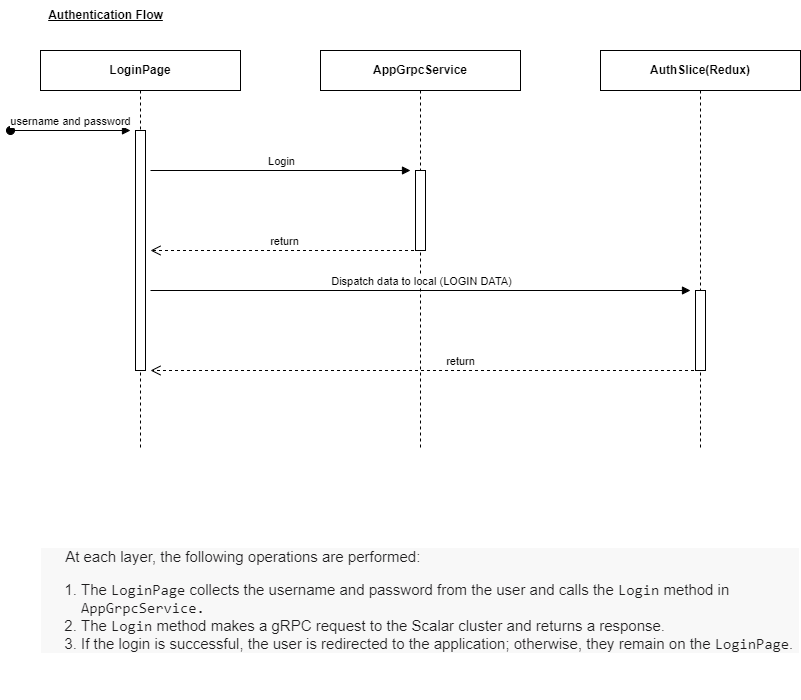
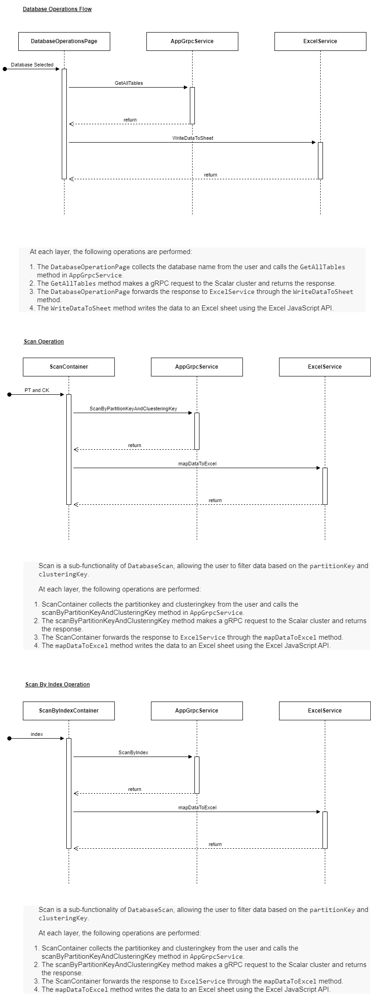
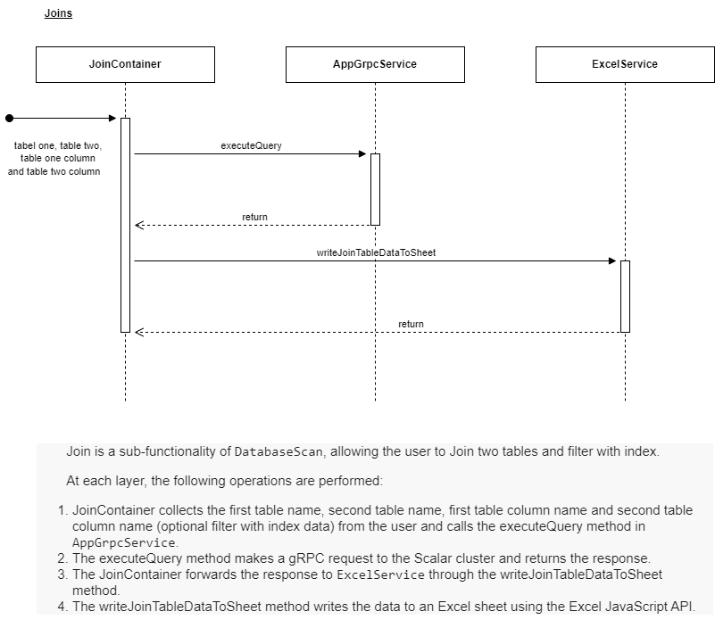
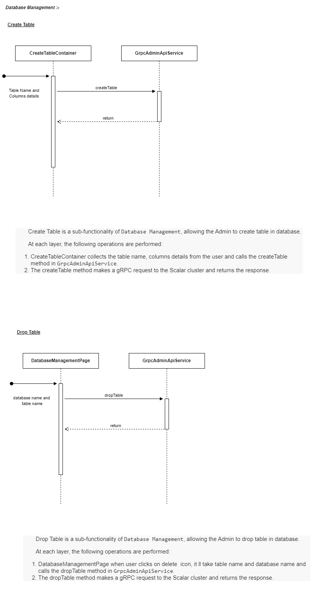
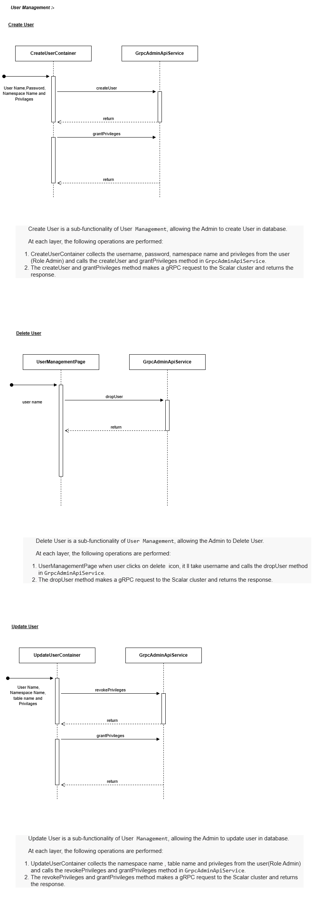
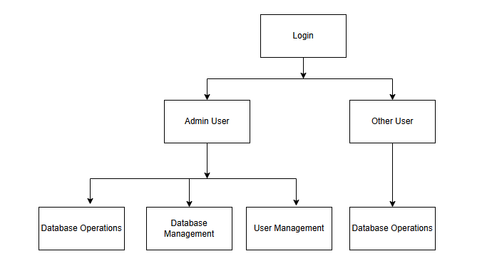
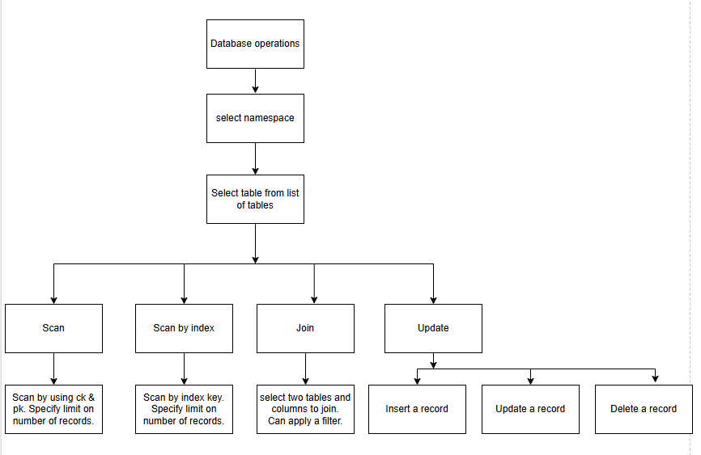
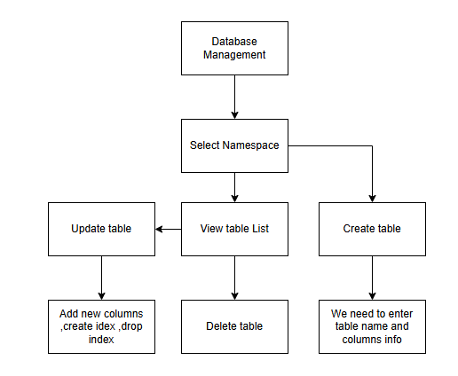
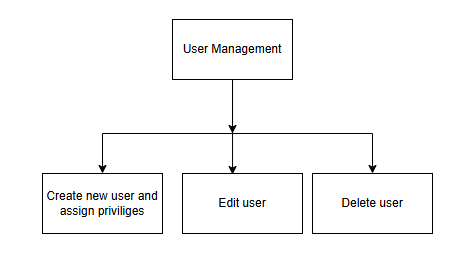

# System Components 
Thorough understanding of how the system operates
 What the components do, their responsibilities, and how they interact.

 ### Authentication Flow

### Database Operations

### Database Management

### User Management

### Data Flow -How information moves within the system.

**User Flow**

**Database Operations**
- Admin/Other user

**Database Management**

**User management**

