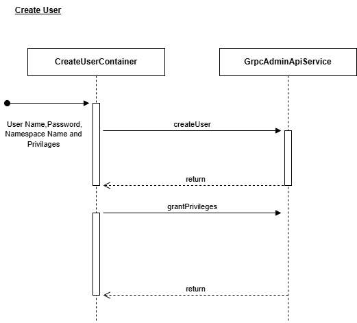
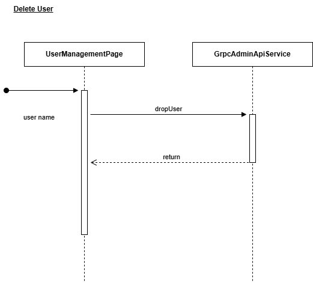
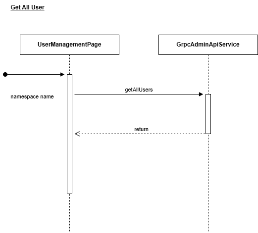
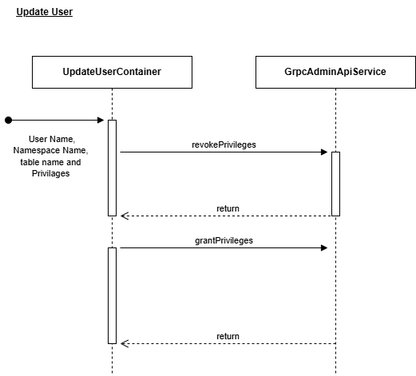
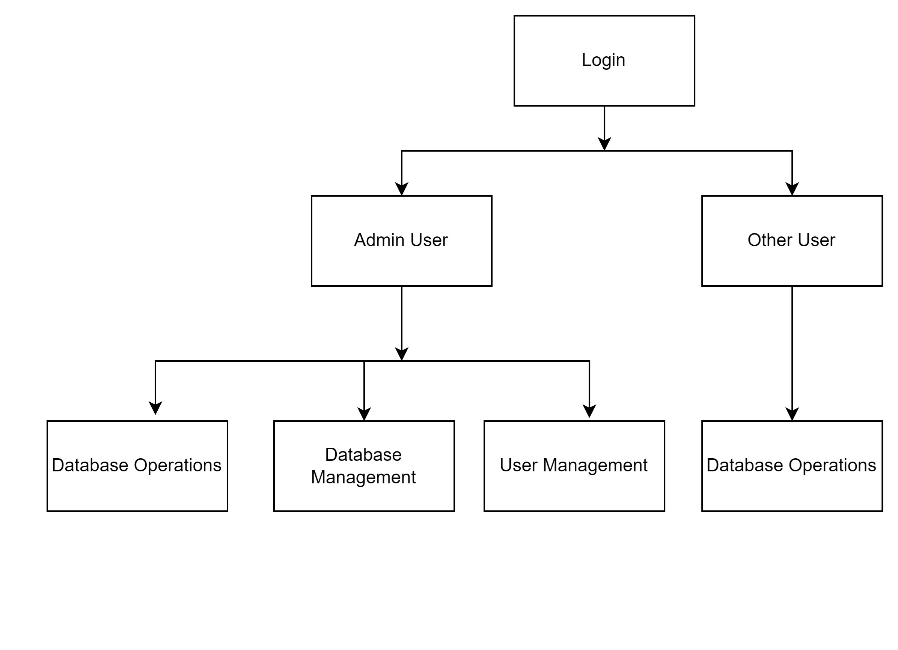
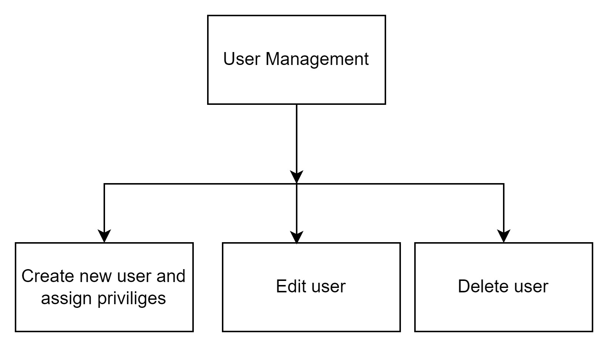

# Functionality Flow Diagrams
Thorough understanding of how the system operates
 What the components do, their responsibilities, and how they interact.

 ### Authentication Flow

Create User is a sub-functionality of User Management, allowing the Admin to create a user in the database.  
At each layer, the following operations are performed:

1. **CreateUserContainer**: Collects the username, password, namespace name, and privileges from the user (Role Admin) and calls the `createUser` and `grantPrivileges` methods in `GrpcAdminApiService`.
2. The `createUser` and `grantPrivileges` methods make a gRPC request to the Scalar cluster and return the response.

Delete User is a sub-functionality of User Management, allowing the Admin to delete a user.  
At each layer, the following operations are performed:

1. **UserManagementPage**: When the user clicks on the delete icon, it takes the username and calls the `dropUser` method in `GrpcAdminApiService`.
2. The `dropUser` method makes a gRPC request to the Scalar cluster and returns the response.

Get All Users is a sub-functionality of User Management, allowing the Admin to see the list of users.  
At each layer, the following operations are performed:

1. **UserManagementPage**: It takes the namespace name and calls the `getAllUsers` method in `GrpcAdminApiService`.
2. The `getAllUsers` method makes a gRPC request to the Scalar cluster and returns the response.

Update User is a sub-functionality of User Management, allowing the Admin to update a user in the database.  
At each layer, the following operations are performed:

1. **UpdateUserContainer**: Collects the namespace name, table name, and privileges from the user (Role Admin) and calls the `revokePrivileges` and `grantPrivileges` methods in `GrpcAdminApiService`.
2. The `revokePrivileges` and `grantPrivileges` methods make a gRPC request to the Scalar cluster and return the response.

### Database Operations

### Database Management

### User Management

### Flow Diagrams of Important Functionalities

**User Flow**

**Database Operations**
- Admin/Other user

**Database Management**

**User management**

