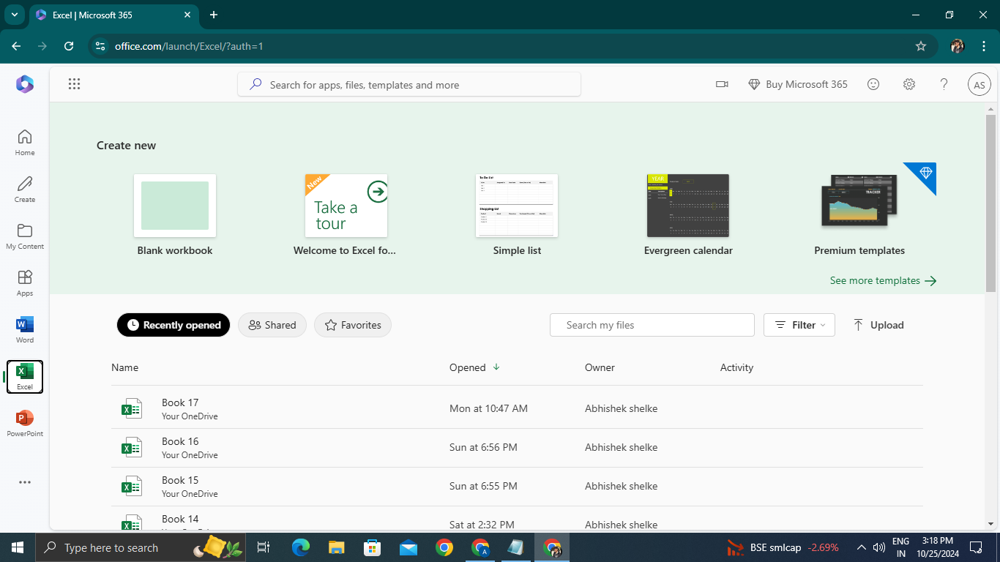
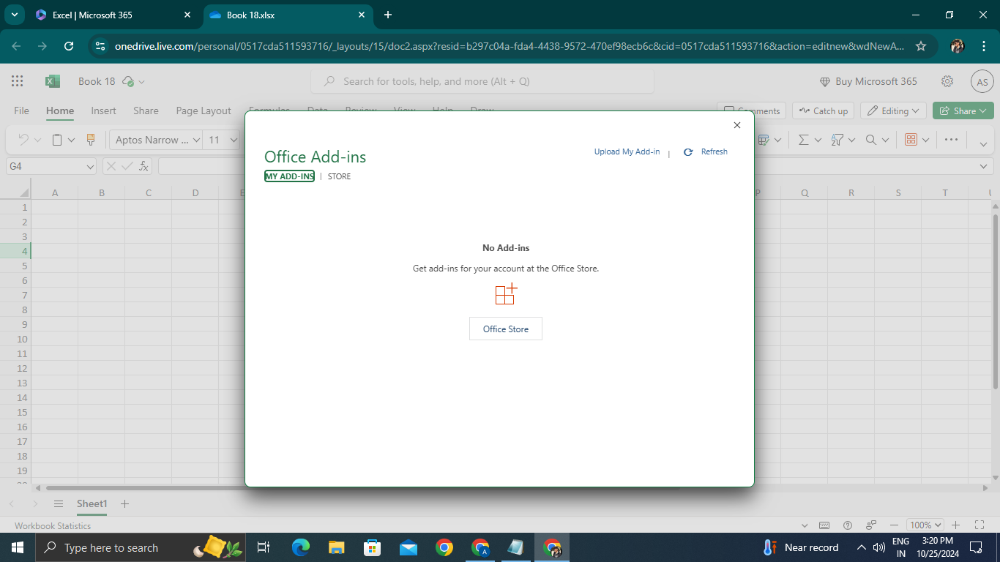
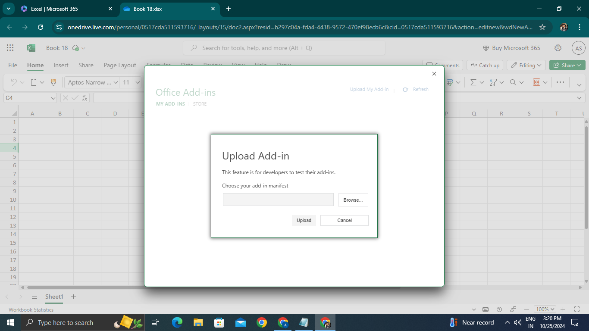

# How to Upload and Use an Excel Add-in in Microsoft 365

1. **Log in**: Open Microsoft 365 and log in with your credentials.

2. **Open Excel**: Go to Excel and create a Blank Workbook.
3. **Access the Add-ins Menu**:
   - Click on the **Insert** tab.
   - Select **Add-ins** and then choose **More Add-ins**.

4. **Office Add-ins Window**: The Office Add-ins window will open.
   - Click on **My Add-ins**.
5. **Upload Your Add-in**:
 
   - Click on **Upload My Add-in**.
   - Browse to locate your add-in manifest file and upload it.
6. **Done**: Your add-in will now appear under My Add-ins and be ready for use.

---

